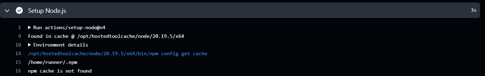
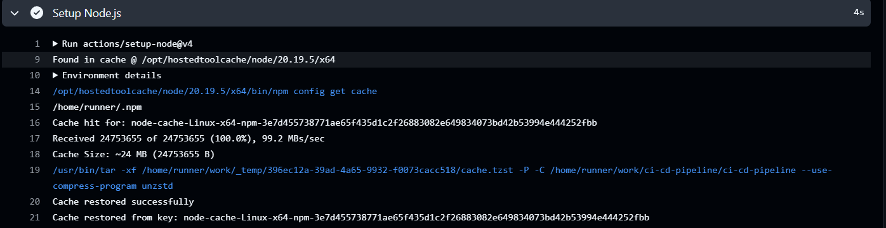

# Pipeline as Code (PaC)

**Date Started:** October 25, 2024  
**Status:** ✅ Basic workflow working

---

## What is Pipeline as Code?

[Your explanation - explain it in your own words like you're teaching someone else]

---

## My First Workflow: `frontend-ci.yml`

### What It Does
- Triggers on: push/PR to main and development branches
- Runs on: Ubuntu Linux (latest)
- Steps:
  1. Checks out code from GitHub
  2. Sets up Node.js v20
  3. Installs dependencies (`npm ci`)
  4. Runs tests (`npm test`)
  5. Builds the app (`npm run build`)

### Why These Steps Matter

**`npm ci` vs `npm install`:**
- [Explain the difference - look it up if you don't know!]
- Why I use `npm ci` in CI: [Your reasoning]

**Working Directory:**
- Why I needed `working-directory: frontend`: [Explain]
- What happens without it: [Explain]

---

## Mistakes I Made

### Error #1: Wrong Working Directory Path
**Problem:** Initially set `working-directory: src` but my folder was `frontend/`

**Error Message:**
```
Error: An error occurred trying to start process '/usr/bin/bash' with 
working directory '/home/runner/work/ci-cd-pipeline/ci-cd-pipeline/src'. 
No such file or directory
```

**What I Learned:**
- `working-directory` must match actual folder structure
- The `defaults.run.working-directory` only applies to `run:` steps, not `uses:` actions
- `actions/checkout` creates the folder structure; subsequent steps navigate into it

**Fix:** Changed to `working-directory: frontend`

---

## Key Concepts

### 1. YAML Structure
```yaml
name: Workflow name
on: Trigger events
jobs:
  job-name:
    runs-on: Operating system
    steps:
      - name: Step description
        uses: Pre-built action OR
        run: Shell command
```

### 2. Triggers (`on:`)
- `push`: Runs when code is pushed to specified branches
- `pull_request`: Runs when PR is opened/updated
- `workflow_dispatch`: Adds manual trigger button

### 3. Runners (`runs-on:`)
- `ubuntu-latest`: Linux VM (most common, fastest)
- `windows-latest`: Windows VM
- `macos-latest`: macOS VM

### 4. Actions (`uses:`) vs Commands (`run:`)
- `uses:`: Pre-built reusable actions (JavaScript/Docker)
- `run:`: Shell commands executed in the runner

---

## Questions I Can Now Answer

**Q: Why doesn't `actions/checkout` need `working-directory`?**  
A: Working directory only applies to  shell commands like 'run'.

**Q: What happens if a test fails?**  
A: If the test fails it will stop the next steps and start Post Chekout code cleanup, finishing the job.

**Q: Can I run multiple jobs in parallel?**  
A: Yes, it is possible by using Parallel Matrix

---
## Optimization: Dependency Caching

**Before:** No cache found


**After:** Cache restored



### How Cache Matching Works

**Step 1: Exact key match**
```yaml
key: ${{ runner.os }}-node-${{ hashFiles('package-lock.json') }}
# Example: "Linux-node-a1b2c3d4e5f6"
```
If found → Restore cache, skip download

**Step 2: Fallback to restore-keys (prefix match)**
```yaml
restore-keys: |
  ${{ runner.os }}-node-
# Matches: "Linux-node-*" (any hash)
```
If found → Restore closest match, install only NEW packages

**Step 3: Save new cache**
- After workflow completes, ALWAYS saves cache with current key
- Even if we restored from `restore-keys`, we save updated version

### Why This Design?

**Scenario:** You add one new package to `package.json`

- ❌ Without restore-keys: Downloads all 500 packages (2 minutes)
- ✅ With restore-keys: Restores 499 packages, downloads 1 new package (10 seconds)

**Performance gain:** 92% faster! 🚀

---

## Research Answers

### Q1: What if package-lock.json is deleted?
**Answer:** 
- `hashFiles()` returns empty/null → cache key changes every run → no cache reuse
- `npm ci` also **requires** package-lock.json to exist (fails without it)
- **Lesson:** Never commit without package-lock.json in Node projects!

### Q2: Cache retention period?
**Answer:** 7 days of inactivity. Also:
- Max 10 GB per repo
- LRU (Least Recently Used) eviction when limit reached

### Q3: `cache` vs `restore-keys`?
**Answer:**
- `key`: Exact match required; if found, restore and stop
- `restore-keys`: Prefix/pattern match; falls back if exact key not found
- Workflow **always saves** new cache with current `key` after completion

### Q4: Why include `runner.os` in cache key?
**Answer:** 
- `node_modules` with native bindings are OS-specific
- A cache built on Linux won't work on Windows (causes errors)
- Example: `bcrypt`, `sharp`, `node-sass` compile native C++ extensions

---

## Performance Impact

**Observation:** With tiny project, caching overhead ≈ time saved

**In production projects:**
- 500+ npm packages
- Without cache: 1-3 minutes install time
- With cache: 5-15 seconds
- **Speedup:** 10-20x faster! 🚀

**When caching hurts:**
- Very small projects (like this demo)
- Packages rarely change
- Trade-off: 5 seconds of cache logic vs 10 seconds of fresh install

**Best practice:** Always cache in real projects; skip for tiny demos

## Next Steps
- [ ] Understand how to run jobs in parallel
- [ ] Learn about matrix builds (test multiple Node versions)